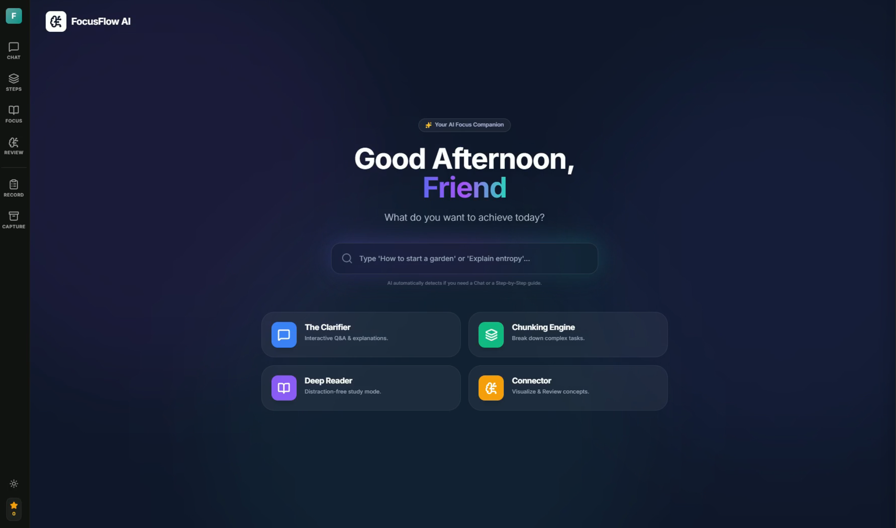

# FocusFlow: An AI-Supported Learning Platform for ADHD

This project is exploring how interactive tools can support attention regulation and task engagement for people with ADHD.

# Demo Video

▶️ Click to watch a short demo

# Interface Overview

Homepage

A1 Chat mode

B1 Chunking mode-Step-by-step Learning

B2 Chunking mode-Task Breakdown Assistant

C1 Read mode

D1 Review mode

Quick Capture & Task Breakdown Assistant

# Project Ownership & AI Use Disclosure

Project conception, UX design, interaction logic, and system decisions were made by me.

Frontend structure, feature selection, and integration logic were implemented by me.

Gemini was used as an assistive tool to:

accelerate boilerplate setup and support debugging or refactoring during development.

All architectural decisions, feature prioritisation, and final implementations were reviewed, adapted, and controlled by me.

# Tech Stack

Frontend: JavaScript / TypeScript

Framework: React / Next.js

AI Integration: Google Gemini API

Tooling: Node.js

# Run and deploy your AI Studio app

This contains everything you need to run your app locally.

View your app in AI Studio: https://ai.studio/apps/drive/1XZYECRtWdy9PQ_8hbu6UNwa0wAgVU5LW

## Run Locally

**Prerequisites:**  Node.js

1. Install dependencies:
   `npm install`
2. Set the `GEMINI_API_KEY` in [.env.local](.env.local) to your Gemini API key
3. Run the app:
   `npm run dev`
